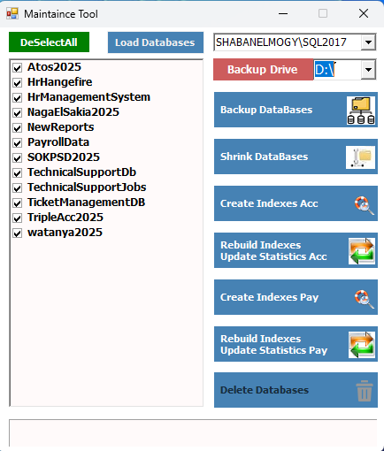

# 🧰 Maintenance Tool – SQL Server Management Utility

  

## 🧩 Overview
**Maintenance Tool** is a desktop application built with **VB.NET** designed to simplify SQL Server database maintenance tasks.  
It provides an intuitive interface for performing multiple administrative operations with just a few clicks.

---

## ⚙️ Features
- 🗃️ **Backup Multiple Databases:**  
  Create backups for one or more selected databases automatically.

- 📦 **Shrink Databases:**  
  Reduce database file size to optimize disk usage.

- 🧹 **Delete Databases with Auto Backup:**  
  Safely remove selected databases after creating a backup copy.

- 🧱 **Create Indexes:**  
  Generate and apply indexes to improve query performance.

- 📊 **Rebuild Statistics:**  
  Refresh database statistics for optimized query execution plans.

---

## 🧰 Technologies Used
- **Language:** VB.NET  
- **Database Engine:** Microsoft SQL Server  
- **Framework:** .NET Framework / .NET Core  
- **IDE:** Visual Studio

---

## 🖥️ How It Works
1. Connect to your SQL Server instance using the application.  
2. Select one or more databases from the list.  
3. Choose the desired maintenance operation (Backup, Shrink, Delete, Index, or Rebuild Stats).  
4. Monitor the progress and completion messages directly in the app.

